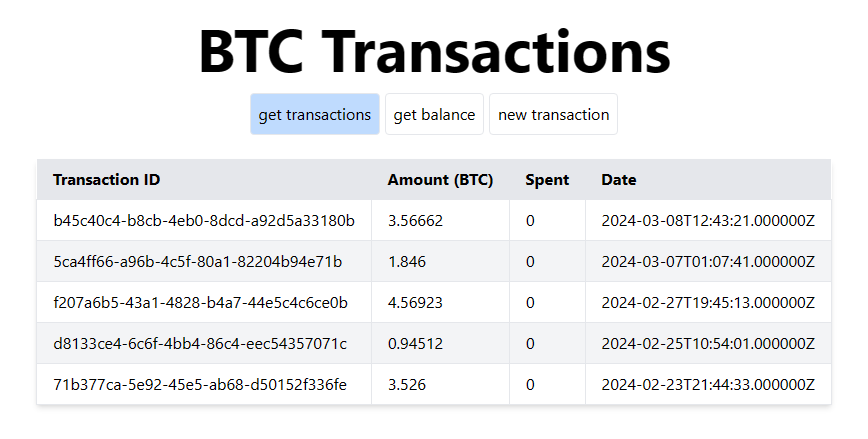
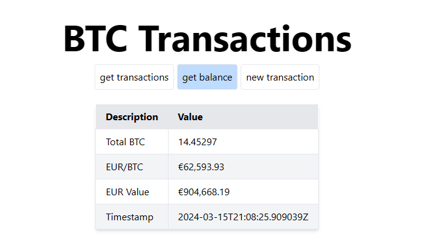
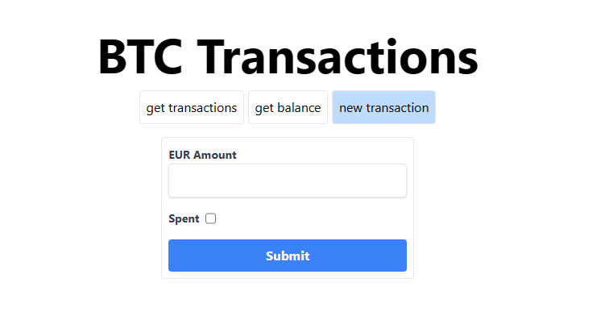

# BTC-API

## Overview

A simplified fake bitcoin transaction api made with Laravel. This is not real, I also wish I had a lot of bitcoin, alas, some things remain distant dreams forever.

## System Requirements

- XAMPP w/ at least PHP v8.1 (https://www.apachefriends.org/download.html), this way it's simpler
- Composer (https://getcomposer.org/download/)

## Installation Instructions

### Clone the Repository
```bash
git clone https://github.com/AvalonAlgo/btc-api
```

### Enter the repository and install the required packages with composer
#### You may encounter some issues with composer zipping. Go to C:\xampp\php\php.ini and uncomment ';extension=zip' to 'extension=zip'
```bash
cd btc-api
composer install
```

### Create the database, run the application and navigate to the main page
```bash
php artisan migrate
php artisan db:seed
php artisan serve
http://127.0.0.1:8000/
```

### Interact with the API either through a CLI (fiddle with the data in the POST request), or the web page
```bash
curl "http://127.0.0.1:8000/api/transactions"
curl "http://127.0.0.1:8000/api/balance"
curl -X POST "http://127.0.0.1:8000/api/transactions" \
    -H "Content-Type: application/json" \
    -d '{"eurAmount": "300000", "spentBoolean": false}'
```



